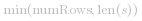
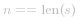
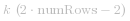
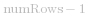
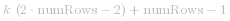
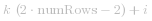
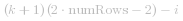

#### 方法一：按行排序

**思路**

通过从左向右迭代字符串，我们可以轻松地确定字符位于 Z 字形图案中的哪一行。

**算法**

我们可以使用   个列表来表示 Z 字形图案中的非空行。

从左到右迭代 *s*，将每个字符添加到合适的行。可以使用当前行和当前方向这两个变量对合适的行进行跟踪。

只有当我们向上移动到最上面的行或向下移动到最下面的行时，当前方向才会发生改变。

```cpp [jG99vE4g-C++]
class Solution {
public:
    string convert(string s, int numRows) {

        if (numRows == 1) return s;

        vector<string> rows(min(numRows, int(s.size())));
        int curRow = 0;
        bool goingDown = false;

        for (char c : s) {
            rows[curRow] += c;
            if (curRow == 0 || curRow == numRows - 1) goingDown = !goingDown;
            curRow += goingDown ? 1 : -1;
        }

        string ret;
        for (string row : rows) ret += row;
        return ret;
    }
};
```
```java [jG99vE4g-Java]
class Solution {
    public String convert(String s, int numRows) {

        if (numRows == 1) return s;

        List<StringBuilder> rows = new ArrayList<>();
        for (int i = 0; i < Math.min(numRows, s.length()); i++)
            rows.add(new StringBuilder());

        int curRow = 0;
        boolean goingDown = false;

        for (char c : s.toCharArray()) {
            rows.get(curRow).append(c);
            if (curRow == 0 || curRow == numRows - 1) goingDown = !goingDown;
            curRow += goingDown ? 1 : -1;
        }

        StringBuilder ret = new StringBuilder();
        for (StringBuilder row : rows) ret.append(row);
        return ret.toString();
    }
}
```


**复杂度分析**

* 时间复杂度：*O(n)*，其中  
* 空间复杂度：*O(n)*

---

#### 方法二：按行访问

**思路**

按照与逐行读取 Z 字形图案相同的顺序访问字符串。

**算法**

首先访问 `行 0` 中的所有字符，接着访问 `行 1`，然后 `行 2`，依此类推...

对于所有整数 *k*，

- 行 *0* 中的字符位于索引   处; 
- 行   中的字符位于索引   处; 
- 内部的 行 *i* 中的字符位于索引   以及   处; 

```cpp [heMTwrqW-C++]
class Solution {
public:
    string convert(string s, int numRows) {

        if (numRows == 1) return s;

        string ret;
        int n = s.size();
        int cycleLen = 2 * numRows - 2;

        for (int i = 0; i < numRows; i++) {
            for (int j = 0; j + i < n; j += cycleLen) {
                ret += s[j + i];
                if (i != 0 && i != numRows - 1 && j + cycleLen - i < n)
                    ret += s[j + cycleLen - i];
            }
        }
        return ret;
    }
};
```
```java [heMTwrqW-Java]
class Solution {
    public String convert(String s, int numRows) {

        if (numRows == 1) return s;

        StringBuilder ret = new StringBuilder();
        int n = s.length();
        int cycleLen = 2 * numRows - 2;

        for (int i = 0; i < numRows; i++) {
            for (int j = 0; j + i < n; j += cycleLen) {
                ret.append(s.charAt(j + i));
                if (i != 0 && i != numRows - 1 && j + cycleLen - i < n)
                    ret.append(s.charAt(j + cycleLen - i));
            }
        }
        return ret.toString();
    }
}
```


**复杂度分析**

* 时间复杂度：*O(n)*，其中  。每个索引被访问一次。
* 空间复杂度：*O(n)*。对于 C++ 实现，如果返回字符串不被视为额外空间，则复杂度为 *O(1)*。