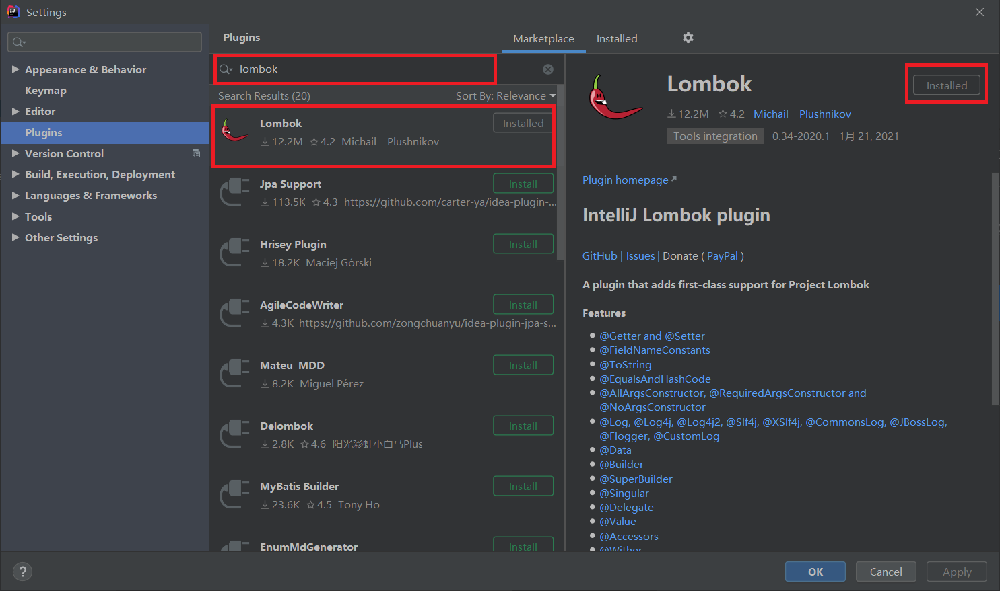

# Lombok

Lombok是一个可以让Java代码变得更加“简洁”、“快速”的第三方工具。

Lombok一般来说分为两部分，分别是Lombok插件和Lombok依赖，这两者需要配合使用才可以生效，缺一不可。   
值得一提的是，Lombok插件和Lombok依赖，在最新版的IDEA和SpringBoot中分别进行了内置，可以让开发者直接使用Lombok。

## Lombok插件

Lombok插件在IDEA 2020.3版本中成为了官方内置插件，开发者无序再进行Lombok插件的安装操作了。

如果如果的IDEA版本低于2020.3，可以自己手动在IDEA上进行Lombok插件的安装。

**Lombok插件的安装**

File -> Settings -> Plugins -> Marketplace -> 在搜索栏中输入Lombok。





## Lombok依赖

```xml
<dependency>
    <groupId>org.projectlombok</groupId>
    <artifactId>lombok</artifactId>
    <version>1.18.16</version>
    <scope>provided</scope>
</dependency>
```

# Lombok使用

Lombok通过注解的方式，在Java程序编译的时候，为Java代码生成get/set等通用方法，我们可以通过反编译class文件的方法，来查看Lombok的效果。

## @Getter

将该注解标识在类上，将会为该类生成get方法。

```java
@Getter
public class User {
    private String username;
}
```

反编译class文件，得到的java文件：

```java
public class User {
    private String username;

    public User() {
    }

    public String getUsername() {
        return this.username;
    }
}
```


## @Setter

将该注解标识在类上，将会为该类生成set方法。

```java
@Setter
public class User {
    private String username;
}
```

反编译class文件，得到的java文件：

```java
public class User {
    private String username;

    public User() {
    }

    public void setUsername(final String username) {
        this.username = username;
    }
}
```


## @NonNull

将该注解标识在类成员变量上，对该成员变量赋值时，不允许使用null值，如果赋值为null，则抛出异常。

```java
@Setter
public class User {
    @NonNull private String username;
}
```

反编译class文件，得到的java文件：

```java
public class User {
    @NonNull
    private String username;

    public User() {
    }

    public void setUsername(@NonNull final String username) {
        if (username == null) {
            throw new NullPointerException("username is marked non-null but is null");
        } else {
            this.username = username;
        }
    }
}
```


## @NoArgsConstructor

将该注解标识在类上，将会为该类生成无参构造方法。

```java
@NoArgsConstructor
public class User {
    private String username;
}
```

反编译class文件，得到的java文件：

```java
public class User {
    private String username;

    public User() {
    }
}
```

## @AllArgsConstructor

将该注解标识在类上，将会为该类生成全参构造方法，如果使用了该注解，类将不会有无参构造方法。

```java
@AllArgsConstructor
public class User {
    private String username;
}
```

反编译class文件，得到的java文件：

```java
public class User {
    private String username;

    public User(final String username) {
        this.username = username;
    }
}
```

## @RequiredArgsConstructor

将该注解标识在类上，将会为该类生成含有被@NonNull注解的属性的构造方法。

```java
@RequiredArgsConstructor
public class User {
    @NonNull private String username;
    private String password;
}
```

反编译class文件，得到的java文件：

```java
public class User {
    @NonNull
    private String username;
    private String password;

    public User(@NonNull final String username) {
        if (username == null) {
            throw new NullPointerException("username is marked non-null but is null");
        } else {
            this.username = username;
        }
    }
}
```


## @ToString

将该注解标识在类上，将会为该类覆写toString()方法。

```java
@ToString
public class User {
    private String username;
}
```

反编译class文件，得到的java文件：

```java
public class User {
    private String username;

    public User() {
    }

    public String toString() {
        return "User(username=" + this.username + ")";
    }
}
```

## @EqualsAndHashCode

将该注解标识在类上，将会为该类覆写equals()方法和hashCode()。

```java
@EqualsAndHashCode
public class User {
    private String username;
}
```

反编译class文件，得到的java文件：

```java
public class User {
    private String username;

    public User() {
    }

    public boolean equals(final Object o) {
        if (o == this) {
            return true;
        } else if (!(o instanceof User)) {
            return false;
        } else {
            User other = (User)o;
            if (!other.canEqual(this)) {
                return false;
            } else {
                Object this$username = this.username;
                Object other$username = other.username;
                if (this$username == null) {
                    if (other$username != null) {
                        return false;
                    }
                } else if (!this$username.equals(other$username)) {
                    return false;
                }

                return true;
            }
        }
    }

    protected boolean canEqual(final Object other) {
        return other instanceof User;
    }

    public int hashCode() {
        int PRIME = true;
        int result = 1;
        Object $username = this.username;
        int result = result * 59 + ($username == null ? 43 : $username.hashCode());
        return result;
    }
}
```


## @Data

@Data注解是一个复合注解，将该注解标识在类上，相当于在类上标注了@Getter、@Setter、@ToString、@EqualsAndHashCode、@RequiredArgsConstructor五个注解。

```java
@Data
public class User {
    @NonNull private String username;
    private String password;
}
```

反编译class文件，得到的java文件：

```java
public class User {
    @NonNull
    private String username;
    private String password;

    public User(@NonNull final String username) {
        if (username == null) {
            throw new NullPointerException("username is marked non-null but is null");
        } else {
            this.username = username;
        }
    }

    @NonNull
    public String getUsername() {
        return this.username;
    }

    public String getPassword() {
        return this.password;
    }

    public void setUsername(@NonNull final String username) {
        if (username == null) {
            throw new NullPointerException("username is marked non-null but is null");
        } else {
            this.username = username;
        }
    }

    public void setPassword(final String password) {
        this.password = password;
    }

    public boolean equals(final Object o) {
        if (o == this) {
            return true;
        } else if (!(o instanceof User)) {
            return false;
        } else {
            User other = (User)o;
            if (!other.canEqual(this)) {
                return false;
            } else {
                Object this$username = this.getUsername();
                Object other$username = other.getUsername();
                if (this$username == null) {
                    if (other$username != null) {
                        return false;
                    }
                } else if (!this$username.equals(other$username)) {
                    return false;
                }

                Object this$password = this.getPassword();
                Object other$password = other.getPassword();
                if (this$password == null) {
                    if (other$password != null) {
                        return false;
                    }
                } else if (!this$password.equals(other$password)) {
                    return false;
                }

                return true;
            }
        }
    }

    protected boolean canEqual(final Object other) {
        return other instanceof User;
    }

    public int hashCode() {
        int PRIME = true;
        int result = 1;
        Object $username = this.getUsername();
        int result = result * 59 + ($username == null ? 43 : $username.hashCode());
        Object $password = this.getPassword();
        result = result * 59 + ($password == null ? 43 : $password.hashCode());
        return result;
    }

    public String toString() {
        return "User(username=" + this.getUsername() + ", password=" + this.getPassword() + ")";
    }
}
```

## @Slf4j

将该注解标识在类上，会给该类注入一个Logger对象。

```java
@Slf4j
public class User {
    private String username;
}
```

反编译class文件，得到的java文件：

```java
public class User {
    private static final Logger log = LoggerFactory.getLogger(User.class);
    private String username;

    public User() {
    }
}
```

## @SneakyThrows

将该注解标识在方法上，可以对受检异常进行捕捉并抛出。

```java
public class App {
    @SneakyThrows
    public static void main(String[] args) {
        Class.forName("com.herenpeng.entity.User");
    }
}
```

反编译class文件，得到的java文件：

```java
public class App {
    public App() {
    }
    public static void main(String[] args) {
        try {
            Class.forName("com.herenpeng.entity.User");
        } catch (Throwable var2) {
            throw var2;
        }
    }
}
```


# 最后

> 本文**GitHub** [https://github.com/herenpeng/code-learn](https://github.com/herenpeng/code-learn) 已收录，欢迎**Star**。