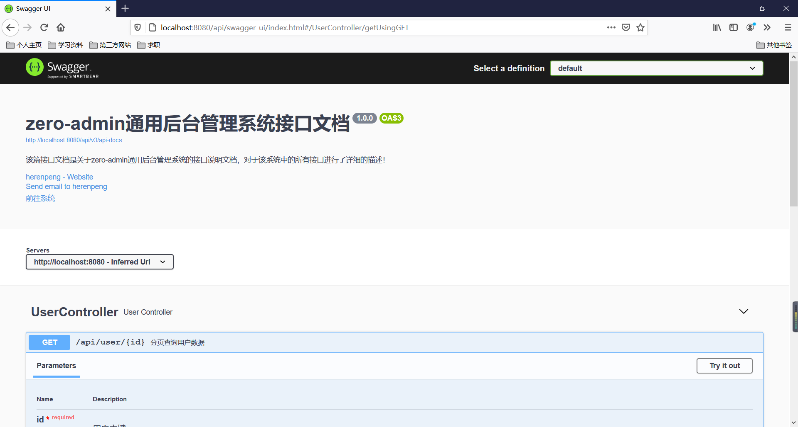

# 什么是Swagger

Swagger 是一个用于解决接口文档问题的框架，主要是通过一些 Swagger 提供的注解，为开发者自动生成相应的接口文档，让开发者从接口文档的编写工作中解放出来。

## Swagger的依赖

- Maven

```xml
<!--swagger的依赖-->
<dependency>
    <groupId>io.springfox</groupId>
    <artifactId>springfox-boot-starter</artifactId>
    <version>3.0.0</version>
</dependency>
```


## Swagger的配置

```java
@EnableOpenApi
@Configuration
public class SwaggerConfig {

    @Bean
    public Docket createRestApi() {
        return new Docket(DocumentationType.OAS_30)
                // 在正是开发中，可以将该属性放置在yal文件中配置，开发环境启用，生产环境禁用
                .enable(true)
                .pathMapping("/")
                .apiInfo(apiInfo())
                .select()
                .apis(RequestHandlerSelectors.withMethodAnnotation(ApiOperation.class))
                .paths(PathSelectors.any())
                .build();
    }

    private ApiInfo apiInfo() {
        return new ApiInfoBuilder()
                // 标题信息
                .title("zero-admin通用后台管理系统接口文档")
                // 描述信息
                .description("该篇接口文档是关于zero-admin通用后台管理系统的接口说明文档，对于该系统中的所有接口进行了详细的描述！")
                // 系统版本
                .version("1.0.0")
                .contact(new Contact("herenpeng", "https://blog.csdn.net/qq_45193304", "xxxxxxxxxx@qq.com"))
                .license("前往系统")
                .licenseUrl("http://zeroadmin.herenpeng.com")
                .build();
    }

}
```


## Swagger的注解

- @ApiModel：该注解用于实体类上，value 属性为对该实体类的描述信息

```java
@ApiModel(value = "用户信息实体类")
public class User implements Serializable {
}
```

- @ApiModelProperty：该注解用于类属性上，value 属性为对该属性的描述信息

```java
@ApiModelProperty(value = "主键ID")
private Integer id;
```

- @Api：该注解用于类上，一般注解在 Controller 上，value 属性为对该 Controller 的描述信息，tags 属性为对应的标签

```java
@Api(value = "用户操作接口", tags = "UserController")
@RestController
@RequestMapping("user")
public class UserController {
}
```

- @ApiOperation：该注解用于被 @Api 注解的 Controller 的方法上，value 属性为对该方法（接口）的描述信息


- @ApiImplicitParams：该注解一般和 @ApiOperation 注解配合使用，用于描述方法（接口）的参数信息


- @ApiImplicitParam：该注解与 @ApiImplicitParams 注解为一个整体，name 属性为参数名称，value 属性为参数的描述信息，dataTypeClass 属性为参数的类型字节码对象，required 属性为是否必须

```java
@ApiOperation(value = "分页查询用户数据")
@ApiImplicitParams({
        @ApiImplicitParam(name = "id", value = "用户主键", dataTypeClass = Integer.class, required = true)
})
@GetMapping("{id}")
public User get(@PathVariable("id") Integer id) {
    User user = new User();
    user.setId(id);
    user.setUsername("Hello");
    user.setPassword("111111");
    return user;
}
```


- @ApiIgnore：该注解用于类上，被该注解标识的类，不会被 Swagger 扫描进入接口文档信息中

```java
@ApiIgnore
@Api(value = "用户操作接口", tags = "UserController")
@RestController
@RequestMapping("user")
public class UserController {
}
```
## Swagger效果图



# 最后
 
> 本文**Github** [https://github.com/herenpeng/code-learn](https://github.com/herenpeng/code-learn) 已收录，欢迎**Star**。